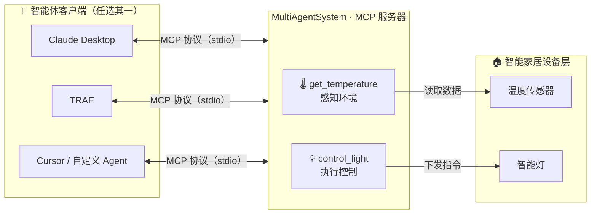

<div align="center">

# 🏠 MCPControler

**基于 Model Context Protocol (MCP) 的智能家居多智能体控制系统**

让任何 AI 智能体（Claude Desktop、TRAE、Cursor……）都能感知环境、控制设备

[](https://www.python.org/)
[](https://modelcontextprotocol.io/)
[]()
[](./LICENSE)

</div>

---

## 📖 简介

**MultiAgentSystem** 是一个 [MCP](https://modelcontextprotocol.io/) 服务器。它把智能家居设备封装成一组标准化的「工具」，任何兼容 MCP 协议的智能体客户端接入后，大模型即可自主决定**何时读传感器、何时控制设备**——无需为每个客户端单独编写集成代码。

- 🌡️ **感知**：读取房间温度传感器数据
- 💡 **执行**：控制房间灯光开关
- 🔌 **协议标准**：基于 MCP 2.x，一次实现，处处接入
- 🪶 **零样板代码**：工具的 JSON Schema 由类型提示与 docstring 自动生成

## 🏗️ 架构



## 🛠️ 工具一览

| 工具 | 功能 | 参数 |
|:-----|:-----|:-----|
| `get_temperature` | 获取指定房间的当前温度 | `room`：房间标识，如 `living_room` |
| `control_light` | 打开 / 关闭指定房间的灯 | `room`：房间名；`state`：`on` 或 `off` |

## 🚀 快速开始

### 1. 安装

```bash
git clone https://github.com/SACO1F/MCPControler.git
cd MultiAgentSystem

# 创建虚拟环境并安装依赖（二选一）
uv venv && uv pip install -r requirements.txt        # 方式一：uv
python -m venv .venv                                  # 方式二：pip
pip install -r requirements.txt                       #   （Windows 先执行 .venv\Scripts\activate）
```

### 2. 运行服务器

```bash
python smarthome_mcp.py        # stdio 传输
# 或使用官方 CLI
mcp run smarthome_mcp.py
```

> 服务器以 **stdio** 方式运行，本身没有可见输出——它等待 MCP 客户端的连接。

### 3. 接入智能体客户端

在任意 MCP 客户端的配置文件中注册本服务器（以 Claude Desktop / TRAE 为例）：

```json
{
  "mcpServers": {
    "smarthome-mcp": {
      "command": "python",
      "args": ["D:/path/to/MultiAgentSystem/smarthome_mcp.py"]
    }
  }
}
```

重启客户端后，即可用自然语言指挥智能体：

> 🧑 「客厅有点暗，顺便看下卧室温度」
>
> 🤖 调用 `get_temperature("bedroom")` → 传感器返回 22.0°C
> 🤖 调用 `control_light("living_room", "on")` → 已打开客厅的灯

## 🧩 工作原理

MCP 2.x 的高阶 API 屏蔽了协议细节——只需用装饰器注册普通 Python 函数：

```python
mcp = MCPServer("smarthome-mcp")

@mcp.tool()
def control_light(room: str, state: str) -> str:
    """打开或关闭指定房间的灯"""
    ...
```

框架会自动完成：

1. 解析函数签名 → 生成工具的 **JSON Schema**（参数名、类型、描述）
2. 解析 docstring → 生成大模型可读的工具说明
3. 处理 **JSON-RPC** 消息编解码与 stdio 传输

因此新增一个设备能力，只需要再写一个函数。

## 🔧 扩展新设备

以「窗帘控制」为例，在 `smarthome_mcp.py` 中追加：

```python
@mcp.tool()
def control_curtain(room: str, position: int) -> str:
    """设置指定房间窗帘的开合程度

    Args:
        room: 房间名，例如 'living_room'
        position: 开合百分比，0（全关）到 100（全开）
    """
    return f"操作成功: {room} 的窗帘已调整到 {position}%。"
```

保存后重启客户端即可，无需任何其他配置。

## 📁 项目结构

```
MultiAgentSystem/
├── smarthome_mcp.py    # MCP 服务器：工具定义与注册
├── requirements.txt    # Python 依赖
├── .gitignore          # 忽略虚拟环境、缓存等运行产物
├── LICENSE             # MIT 协议
└── README.md
```

## 📄 许可证

本项目基于 [MIT License](./LICENSE) 开源，欢迎自由使用与二次开发。
